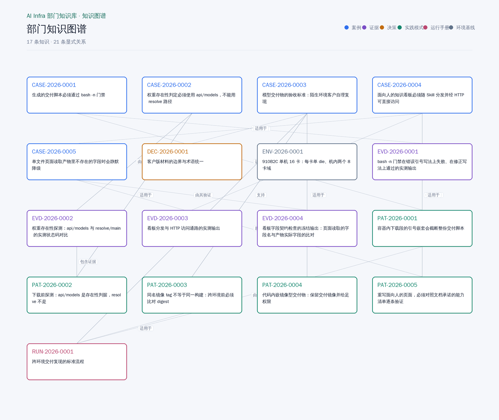
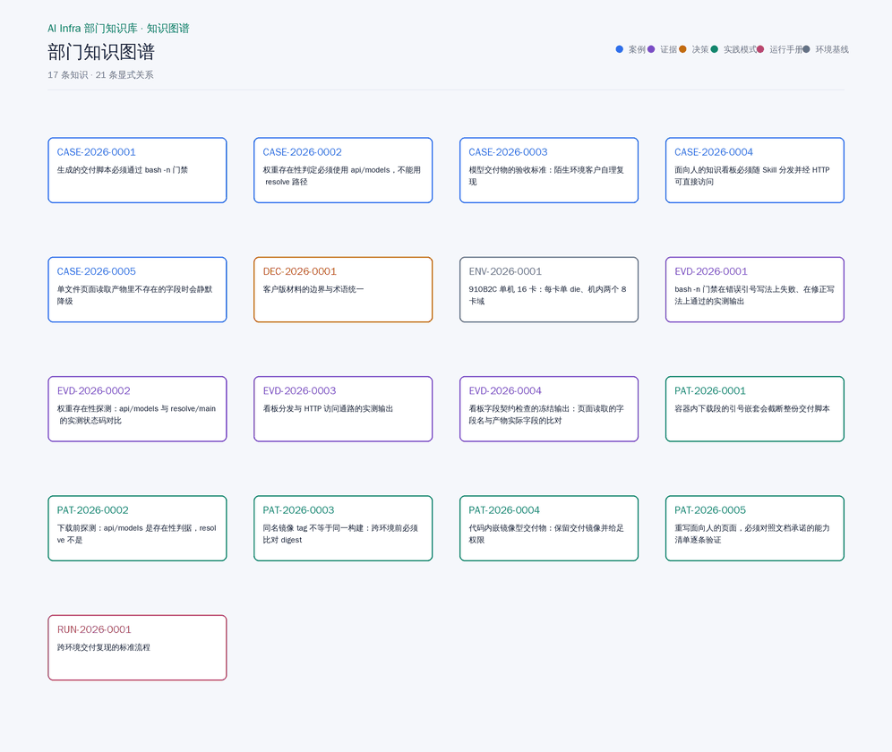

# AI Infra 部门知识库 Skill

面向 AI Infra 团队的**验证、交付和知识沉淀**协作工具。把模型适配、算子迁移、服务化调优、故障定位、NPU 复现和客户交付中的可复用结论，沉淀为有证据、有适用边界、可检索、可追溯的组织知识。

> 本仓只分发 Skill、模板、Schema 和固定工具链；真实部门知识放在独立知识仓，通过 Git 分支和 PR 协作。

[](LICENSE)
[](https://nodejs.org/)
[](#质量门禁)
[](https://hermes-agent.nousresearch.com/docs)

## 它解决什么问题

AI Infra 团队的有效经验通常分散在测试日志、模型包、交付报告、调优记录、故障复盘和聊天里。这个 Skill 把这些内容纳入同一条可审计闭环：

- **测试成果**：测试目的、输入输出、环境、指标、结果、失败原因和复现命令
- **客户交付**：交付物清单、依赖、启动方式、验收标准、复现状态和适用环境
- **调优经验**：基线、改动、配对结果、性能收益、分辨力和回滚条件
- **问题复盘**：症状、最小复现、根因、修复、回归验证和剩余风险
- **知识入库**：Case、Evidence、Decision、Pattern、Runbook、Environment
- `inference-delivery-qa`：针对推理部署、算子调优、benchmark 数据和客户交付包的证据质检 Skill

## 安装

```bash
hermes skills install leafsys1/ai-infra-department-wiki/skills/ai-infra-department-wiki
```

或：

```bash
hermes skills install https://raw.githubusercontent.com/leafsys1/ai-infra-department-wiki/main/skills/ai-infra-department-wiki/SKILL.md
```

安装后，主要入口是 `scripts/team-wiki.js`。完整运行时文件由 `SKILL.md` 的 Support Files 清单维护，并由安装完整性测试守护。

## 知识模型

| 类型 | 记录什么 | 必须回答 |
| --- | --- | --- |
| **Case** | 一个适配、调优、故障或交付任务 | 做了什么，结果是什么，适用边界是什么 |
| **Evidence** | 压测、日志摘要、NPU 运行结果、验收证据 | 谁在什么环境用什么命令验证 |
| **Decision** | 选型、技术路线和取舍 | 为什么选，放弃了什么，何时重新评估 |
| **Pattern** | 可跨项目复用的做法 | 哪些条件下有效，哪些情况不能套用 |
| **Runbook** | 可执行的操作步骤 | 同事能否按步骤复现或回滚 |
| **Environment** | CANN、驱动、镜像、硬件和依赖基线 | 这条结论依赖什么环境 |

一条重要结论不应只有一份 Markdown。Case 应通过关系引用 Evidence；客户交付应同时记录交付物、运行方式和验收证据；Pattern 只有通过 held-out Skill gate 才能升级为可复用 Skill。

## 看板预览



上图由知识仓自己的构建产物渲染：`scripts/render-graph-assets.py <知识仓>` 读取 `generated/graph-data.json`（关系）和 `generated/catalog.json`（标题与类型），用看板同一套配色和关系标签绘制，所以它只可能显示该知识仓当前的内容。同一条命令还会输出一段动画（关系逐条画出的过程，再按顺序走一遍记录）：



本机没有浏览器，因此这两张图是**数据渲染图**，不是页面截图；看板本身（`generated/dashboard.html`）在 `http(s)://` 下打开即可交互浏览。

## 工作流

### 建仓和固定工具链

```bash
node scripts/team-wiki.js init ../department-knowledge --name "AI Infra Department"
cd ../department-knowledge
node .department-tools/scripts/team-wiki.js validate . --strict
```

`init` 会生成记录目录、脱敏策略、CI、PR 模板、CODEOWNERS，并将验证器、Schema 和模板固定到 `.department-tools/`。客户资料、原始日志、内部地址和凭据不进入本工具仓；真实知识仓按组织安全要求设为私有。

### 提交测试或交付成果

```bash
node .department-tools/scripts/team-wiki.js sync .
node .department-tools/scripts/team-wiki.js capture . case CASE-2026-0007
node .department-tools/scripts/team-wiki.js capture . evidence EVD-2026-0007
# 编辑 drafts/，完成后将记录移动到 records/ 并补齐引用
node .department-tools/scripts/team-wiki.js validate . --strict
node .department-tools/scripts/team-wiki.js publish . records/cases/inference/CASE-2026-0007.md --push
```

每个交付或调优记录至少包含：目标、基线、改动、执行命令、真实环境、结果、验收标准、证据位置、适用边界和剩余风险。结论必须区分静态校验、NPU smoke/full、独立环境复验和客户验收。

### 检索和构建

```bash
node .department-tools/scripts/team-wiki.js build .
node .department-tools/scripts/team-wiki.js overview .
node .department-tools/scripts/team-wiki.js query . 910B2C 吞吐 --status verified
node .department-tools/scripts/team-wiki.js show . CASE-2026-0001
node .department-tools/scripts/team-wiki.js related . CASE-2026-0001
```

## AI Infra 质检与交付

对模型适配、算子调优、NPU 复现、服务化性能和客户交付做质检时，使用同仓的 `inference-delivery-qa` Skill。它提供 G0-G8 九道门禁、证据白名单、CSV/时序/TPOT 自洽检查、来源真实性五维边界、冻结包哈希和保守状态机。

```bash
python3 skills/inference-delivery-qa/scripts/qa.py init --out <run>/input
python3 skills/inference-delivery-qa/scripts/qa.py audit --root <run>/evidence --input <run>/input/audit-input.json --out <run>/mechanical
```

质检结果按 `references/inference-delivery-qa-bridge.md` 入库：质检包是 Evidence 集合，Case 保存结论和适用边界；`HOLD`、`BLOCKED`、`PENDING_INDEPENDENT_REVIEW` 不得写成 `verified`，客户放行必须由独立授权人员批准确切冻结包。


看板随 Skill 一起分发（`skills/ai-infra-department-wiki/assets/dashboard/index.html`），`build` 会把它复制到知识仓的 `generated/dashboard.html`，与它读取的 `catalog.json` 同目录。它是单文件、无构建、无服务器的 GitHub 风格阅读界面：

- **概览**：知识总量、已验证比例、贡献者、关系数、活动热力图
- **知识目录树**：按 Case、Evidence、Decision、Pattern、Runbook、Environment 浏览
- **知识阅读**：记录标题、Markdown 正文、状态、负责人、模型、加速器、标签、更新时间
- **引用和来源**：关系图入口、上下游引用、Evidence 来源路径
- **人机共用**：人用看板搜索阅读，Agent 用 `query/show/related/overview` 和 `generated/catalog.json`
- **本地优先**：catalog 只在浏览器本地读取，不上传

```bash
# 1. 生成 catalog.json 和 dashboard.html
node .department-tools/scripts/team-wiki.js build <知识仓>

# 2. 打开看板（http(s) 下自动读取同目录 catalog.json）
xdg-open <知识仓>/generated/dashboard.html
```

从 `file://` 直接打开时浏览器禁止读取同目录文件，点看板右上角 **导入 catalog.json** 选择 `<知识仓>/generated/catalog.json` 即可；或用任意静态服务器（如 `python3 -m http.server -d <知识仓>/generated`）访问。

## AI Agent 接口

Agent 不依赖页面 DOM，直接使用确定性的 CLI 和机器可读产物：

| 目标 | 命令 |
| --- | --- |
| 全仓摘要 | `overview <repo> --json` |
| 搜索知识 | `query <repo> <terms...> --json` |
| 阅读单条记录 | `show <repo> <id>` |
| 查引用关系 | `related <repo> <id>` |
| 同步变更 | `sync <repo>` |
| 校验和构建 | `validate <repo> --strict`、`build <repo>` |

## 质量门禁

```bash
npm run verify:skill-install
node --test tests/js/*.test.js
node workbench/scripts/check-repository-privacy.mjs
```

仓库还包含客户交付型知识应遵守的基本原则：不夸大验证范围；不把复用本机权重池写成现场自动下载；不把静态 validator PASS 写成真实 NPU PASS；不把内部机号、IP、重试过程和排障细节带进客户版材料。

## 许可证

MIT
